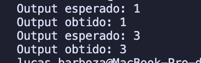

# BST Reorder Ways

## O problema

As entradas são:

## A resolução

Primeiro, pensei em usar DFS para explorar cada ilha, marcando as células visitadas para evitar contagens duplicadas. Cada vez que encontro uma nova célula de terra ('1') que não foi visitada, incremento o contador de ilhas e inicio uma DFS a partir dessa célula para marcar todas as células conectadas como visitadas.

## Conclusões

O algoritmo utilizado foi o DFS (Depth-First Search), que é eficaz para explorar todas as células conectadas em uma grade e identificar componentes conectados, como ilhas neste caso.

## Capturas de Tela (Testes)

