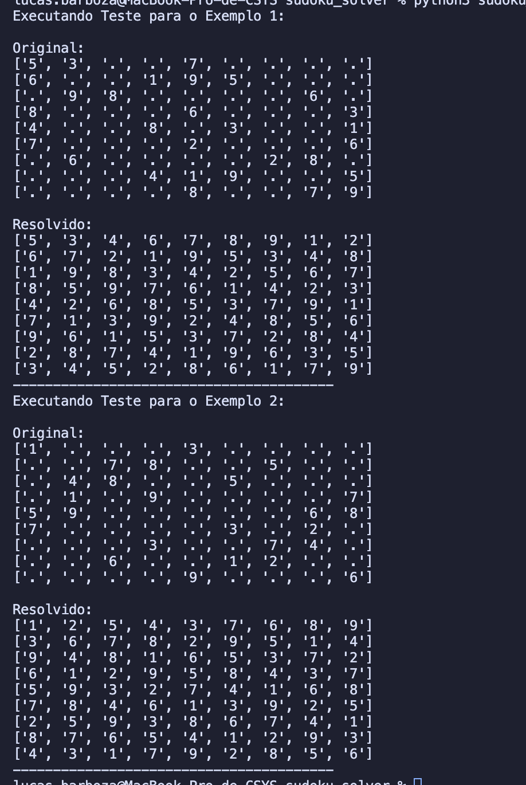

# Sudoku Solver

## O problema

Um solucionador de Sudoku, preenchendo as células vazias , onde cada célula deve conter um número de 1 a 9, de forma que todas as regras do Sudoku sejam satisfeitas.

As entradas esperadas são:

- board: um tabuleiro 9x9 representada como uma lista de listas, onde cada célula pode conter um dígito de '1' a '9' ou '.' para células vazias.

## A resolução

Para resolver esse problema, utilizei uma abordagem de backtracking, junto com tabela hash. A ideia é tentar preencher cada célula vazia com um número válido, verificando se o número já existe na mesma linha, coluna ou subgrade 3x3. Se encontrar um número válido, avanço para a próxima célula vazia. Se não houver números válidos, volto para a célula anterior e tento o próximo número possível.

## Conclusões

O algoritmo que usei foi o backtracking, que é uma técnica comum para resolver problemas de busca e otimização. A tabela hash (sets) foi usada para armazenar os números já presentes em cada linha e coluna, permitindo verificações rápidas em tempo constante.

## Capturas de tela (Saída dos testes)

